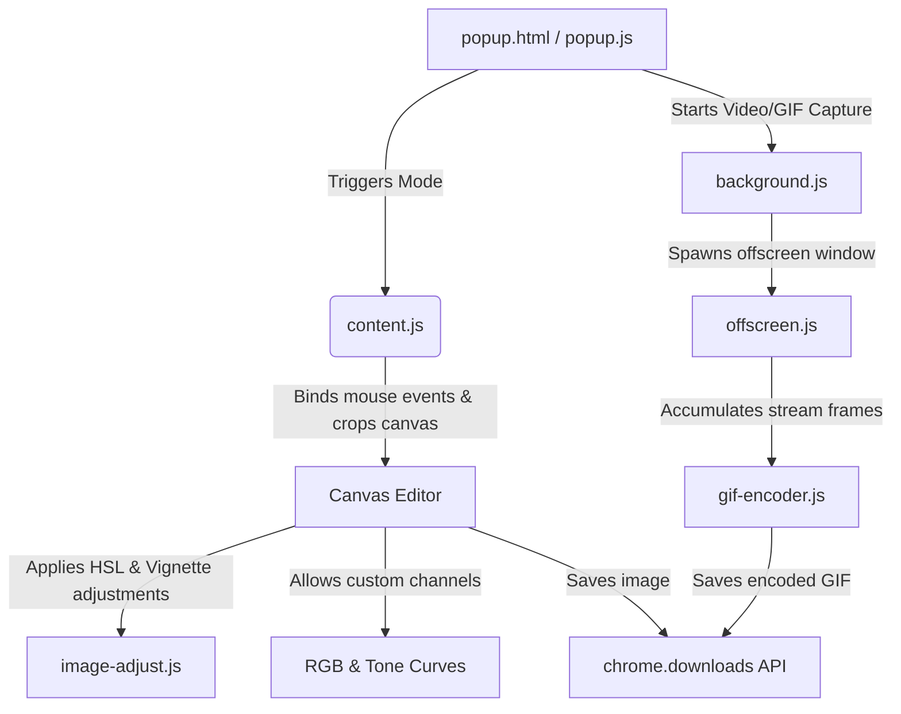

# Snappy Pro

  

<h3 align="center">Snappy Pro</h3>

  A high-fidelity, developer-grade Chrome Extension for screen capture, tab recording, and interactive image manipulation. Build custom annotations, apply real-time filters, adjust light/color curves, or encode animated GIFs—all within a single, lightweight browser extension.

  
  
  
  

---

## Key Capabilities

### 1. Screen Capture Modes
- **Viewport Capture (Visible Area)**: Instantly snap whatever is currently visible in the active tab viewport.
- **Full-Page Scrolling Capture**: Automatically scrolls and stitches the entire web page layout into a single, high-resolution canvas.
- **Element Selector**: Hover and lock onto any specific DOM element (div, image, video) to snapshot it with pixel-perfect boundaries.
- **Custom Region Picker**: Freeform drag-to-select tool with adjustable corner handles for fine-tuned cropping.
- **Countdown Timer**: 3s, 5s, or 10s delay capture to set up dropdowns, animations, or hover states before snapping.

### 2. Tab Video & Animation Recording
- **Tab Video Recorder**: Captures tab video and audio streams via `chrome.tabCapture` and exports as high-quality WebM (VP9/VP8).
- **High-Fidelity GIF Encoder**: Captures up to 15 seconds of tab interaction at 8 FPS, builds a custom 256-color palette/look-up table (LUT) from sample frames, applies LZW compression, and outputs a highly optimized GIF89a file.
- **Offscreen Rendering**: Recording runs in an offscreen document to ensure smooth, un-throttled performance without locking the active tab.

### 3. Professional Annotation Canvas
- **Creative Brushes**: Freehand pen, high-contrast highlighter, and a pixel-level eraser.
- **Vector Shapes**: Lines, directional arrows, rectangles, and circles.
- **Dynamic Text Elements**: Double-click to type text annotations with automatic shadows to ensure high contrast against any background.
- **Step Numbering Bubble**: Click to stamp sequential bubbles (1, 2, 3...) to create easy-to-follow user guides.
- **Blur / Redaction Brush**: Blur sensitive credentials, API keys, or faces with an adjustable blur radius.
- **Palette & Color Swatches**: 2x4 palette grid featuring hand-selected high-fidelity colors, plus a native color-picker for custom colors.
- **Interactive Zoom & Pan**: Scroll or pinch to zoom from 10% to 800%. Canvas stays crisp while you edit.

### 4. Developer-Grade Image Adjustments
Powered by a lightweight, pure JavaScript image processing engine (`image-adjust.js`) executing per-pixel operations on HTML5 `ImageData` buffers:
- **Light Controls**: Exposure, contrast, highlights, shadows, whites, and blacks.
- **Color Calibration**: Color temperature, tint, vibrance, saturation, and hue.
- **Details & Effects**: Clarity (midtone contrast), 3x3 Laplacian-enhanced sharpening, grain noise, vignette, and matte fades.
- **12 One-Click Filters**: Includes presets like Vivid, Dramatic, Matte, BW, Vintage, Cinematic, Warm, and Cool.
- **Channel Curves Editor**: Precision control over Red, Green, Blue, and Master luminance channels via interactive cubic-spline tone curves.

### 5. Capture History Hub
- **Automatic Storage**: Saves captures to internal storage using base64 serialization.
- **Lightbox Viewer**: Preview, download in different formats (PNG, JPEG, WebP), or copy directly to your clipboard.
- **Selective / Global Cleanup**: Delete individual items or wipe your entire history with one click.

---

## Installation Guide

Follow these steps to run Snappy Pro locally:

1. Clone or download this repository to your local machine.
2. Open your Google Chrome browser and navigate to `chrome://extensions/`.
3. In the top-right corner, toggle **Developer mode** to **ON**.
4. In the top-left, click the **Load unpacked** button.
5. Select the root directory of this project (`snappy`).
6. Pin **Snappy Pro** to your extension bar and get capturing!

---

## Keyboard Shortcuts

| Shortcut | Description | MacOS Default | Windows / Linux Default |
| :--- | :--- | :--- | :--- |
| **Visible Area Capture** | Snaps the current viewport | `MacCtrl + Shift + S` | `Alt + Shift + S` |
| **Region Capture** | Launches drag-to-select crop | `MacCtrl + Shift + R` | `Alt + Shift + R` |
| **Full Page Capture** | Initiates scrolling page capture | `MacCtrl + Shift + F` | `Alt + Shift + F` |
| **Cancel Selection** | Quits region picker or editor | `Escape` | `Escape` |
| **Undo Annotation** | Removes the last drawn shape | `Cmd + Z` | `Ctrl + Z` |
| **Redo Annotation** | Restores the last undone shape | `Cmd + Y` | `Ctrl + Y` |
| **Copy Screenshot** | Copy editor canvas to clipboard | `Cmd + C` | `Ctrl + C` |
| **Save Screenshot** | Trigger direct download of the image | `Cmd + S` | `Ctrl + S` |

---

## Architectural Overview

### Script Context Division
1. **Popup Context (`popup.js`)**: Executes in the extension popup window. It determines which capture action to perform and injects the runtime files (`content.js`, `image-adjust.js`, and `styles.css`) dynamically into the target web page.
2. **Tab Capture Context (`content.js`)**: Run directly inside the webpage's DOM. Renders the crop selection area, handles keybindings, and displays the dark-theme Editor UI over the web page.
3. **Engine Context (`image-adjust.js` & `gif-encoder.js`)**: Pure, self-contained JavaScript modules that manipulate raw canvas frames or encode arrays of binary bytes. Free of browser DOM requirements.
4. **Offscreen Context (`offscreen.js`)**: Run in an isolated, offscreen tab. Obtains background access to capture streams (via `getUserMedia`) and runs heavy encoding tasks in the background without affecting UI frames.

---

## Security & Scope Restrictions
By default, Chrome security policies restrict extension code execution on:
- Internal system URLs (`chrome://*`)
- The Chrome Extension Web Store
- Local filesystem files (unless explicitly permitted in the extension details tab)

## License
Licensed under the **MIT License**. Free for personal and commercial utilization.
